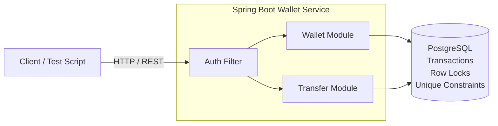
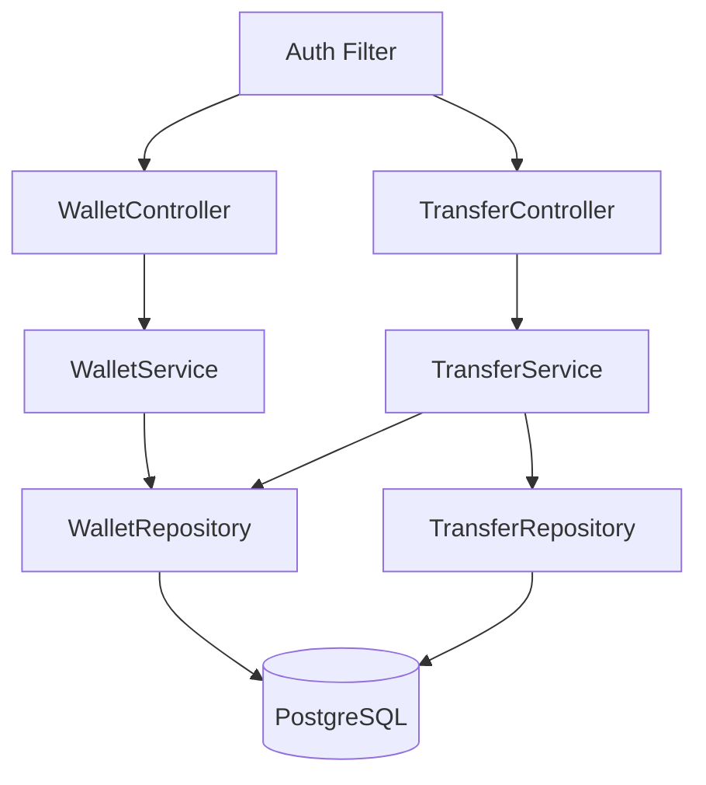

HIGH LEVEL DESIGN

```mermaid
flowchart LR

    Client[Client / Test Script]

    subgraph App["Spring Boot Wallet Service"]
        Auth[Auth Filter]

        Wallet[Wallet Module]
        Transfer[Transfer Module]

        Auth --> Wallet
        Auth --> Transfer
    end

    DB[(PostgreSQL<br/>Transactions<br/>Row Locks<br/>Unique Constraints)]

    Client -->|HTTP / REST| Auth

    Wallet --> DB
    Transfer --> DB
```

---

LOW LEVEL DESIGN

```mermaid
flowchart TD

    Auth[Auth Filter]

    WC[WalletController]
    TC[TransferController]

    WS[WalletService]
    TS[TransferService]

    WR[WalletRepository]
    TR[TransferRepository]

    DB[(PostgreSQL)]

    Auth --> WC
    Auth --> TC

    WC --> WS
    TC --> TS

    WS --> WR

    TS --> WR
    TS --> TR

    WR --> DB
    TR --> DB
```
