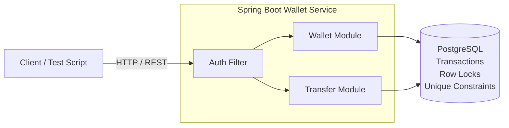
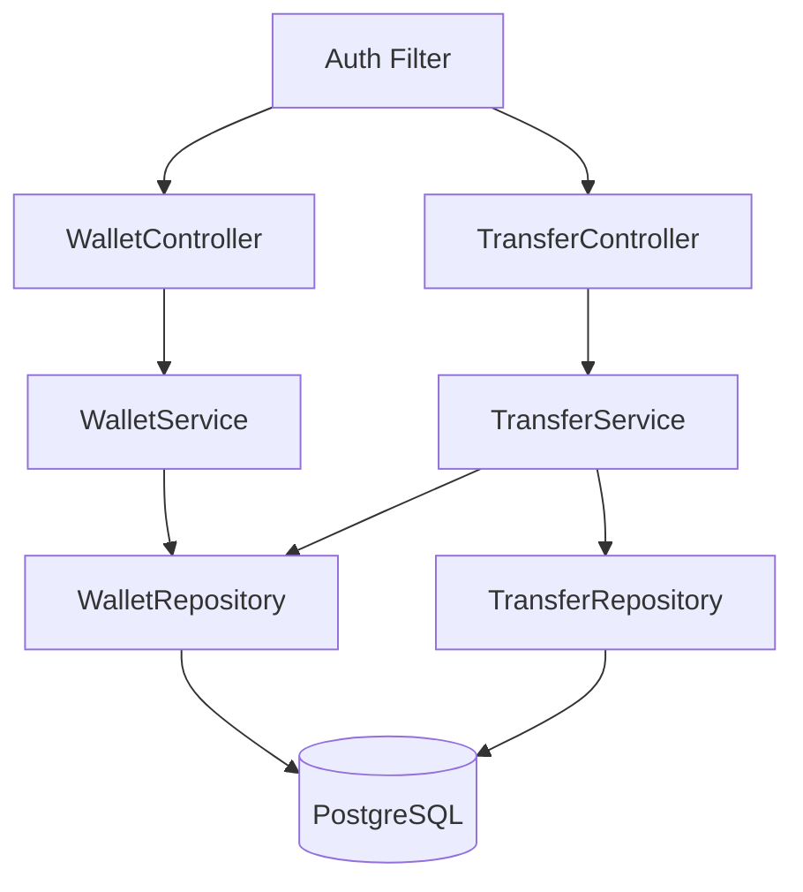

HIGH LEVEL DESIGN

---

Entities:
USER: user_id, user_name, other_details, created_at
WALLET: wallet_id, user_id, balance_paise, created_at, updated_at
TRANSFER: transfer_id, from_wallet_id, to_wallet_id, amount_paise, idempotency_key, status, created_at, updated_at
TRANSFER STATUS: PENDING, SUCCESS, DECLINED

---

LOW LEVEL DESIGN

Entities:
Controllers: WalletController → createOrGetWallet(), getWallet(); 
             TransferController → createTransfer(), getTransfer()
Services: WalletService → wallet creation/read; 
          TransferService → idempotency, lock wallets, check balance, debit/credit, update status
Repositories: UserRepository, WalletRepository, TransferRepository → DB operations, findById(), findByUserId(), findByIdempotencyKey(), save()
Concurrency: PostgreSQL row locking (FOR UPDATE) + deterministic lock order + unique constraints for user_id and idempotency_key